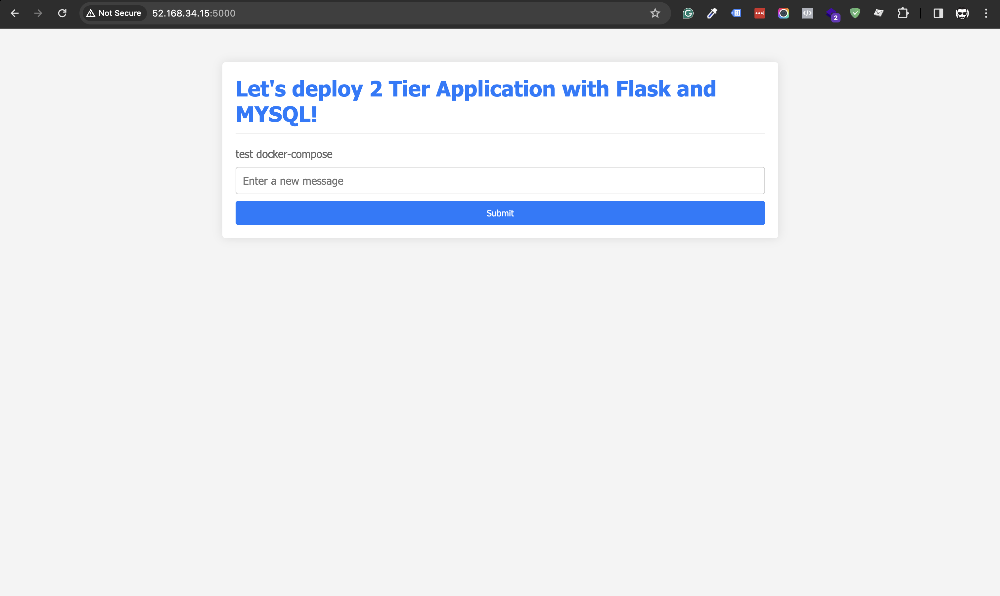

# Two-tier Flask app and MYSQL Deploy in Docker

## Prerequisites
- Docker
- Docker-compose
- Git

### Prepare

1. Clone this repository 

```bash
git clone 
```

2. Go to the project file

3. Remove the Dockerfile and Docker-compose file

```bash
rm -rf Dockerfile docker-compose.yml
```

### Let's start

1. Create a Docker file
```bash
FROM python:3.9-slim

WORKDIR /app

RUN apt-get update -y \
    && apt-get upgrade -y \
    && apt-get install -y gcc default-libmysqlclient-dev pkg-config \
    && rm -rf /var/lib/apt/list*

COPY requirements.txt .

RUN pip install mysqlclient
RUN pip install --no-cache-dir -r requirements.txt

COPY . .

CMD [ "python", "app.py" ]
```

2. Create an image

```bash
docker build . -t flashapp:latest
```

3. Create a docker network to eastablish a channel to communicate flask app and Mysql

```bash
docker network create ttnetwork
```

4. Run the flaskapp image in this network

```bash
docker run -d -p 5000:5000 --network=ttnetwork -e MYSQL_HOST=mysql -e MYSQL_USER=admin -e MYSQL_PASSWORD=admin -e MYSQL_DB=myDB --name=flaskapp flaskapp:latest
```

5. Run the Mysql container in the same network

```bash
docker run -d -p 3306:3306 --network=ttnetwork -e MYSQL_DATABASE=myDB -e MYSQL_USER=admin -e MYSQL_PASSWORD=admin -e MYSQL_ROOT_PASSWORD=admin --name=mysql mysql:5.7
```

6. Create a table within Mysql container

```bash
docker exec -it [mysql_container_ID] bash
```
7. Login to Mysql using your created password
```bash
mysql -u root -p
```
8. Show DB and Choose the correct DB
```bash
Show databases;

use <correct_DB_name>;

CREATE TABLE messages (
    id INT AUTO_INCREMENT PRIMARY KEY,
    message TEXT
);
```
### Your flash application should be run <your_ip_address:5000>


## Let's make it more handy to deploy
here we will use docker-compose to avoid running multiple command to run each container and network

1. Let's stop and remove both container

```bash
docker stop <flashapp_container_ID> <Mysql_container_ID>
```
Now Let's remove these both container using 

```bash
docker rm
```
2. Publish the flaskapp:latest image to your DockerHub

3. Create a docker-compose.yml file

```bash
version: '3'
services:
  backend:
    image: mobinite/flaskapp:latest
    ports:
      - "5000:5000"
    environment:
      MYSQL_HOST: "mysql"
      MYSQL_USER: "admin"
      MYSQL_PASSWORD: "admin"
      MYSQL_DB: "myDb"
    depends_on:
      - mysql

  mysql:
    image: mysql:5.7
    environment:
      MYSQL_DATABASE: myDb
      MYSQL_USER: "admin"
      MYSQL_PASSWORD: "admin"
      MYSQL_ROOT_PASSWORD: "admin"
    ports:
      - "3306:3306"
    volumes:
      - ./message.sql:/docker-entrypoint-initdb.d/message.sql
      - mysql-data:/var/lib/mysql
volumes:
  mysql-data:
```

4. Now let's run docker compose file

```bash
docker-compose up -d
```


Note: When we use docker-compose, we don't need to create separate network it will create automatically. 



